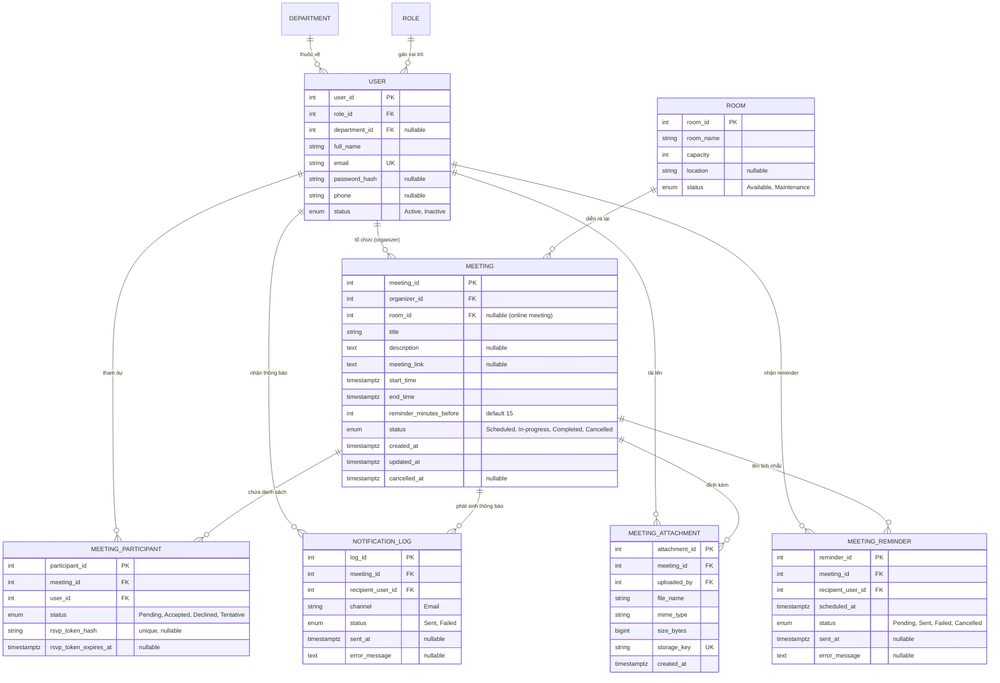

# Kế hoạch & Tiến độ Xây dựng — Hệ thống Quản lý Lịch họp (Meeting Management System)

> **Tài liệu tổng hợp và điều phối triển khai kỹ thuật**  
> Dựa trên toàn bộ tài liệu dự án trong `TTCS02`:
> 1. **Product Backlog & Vision**: [`du_an_quanlylichhop01.png`](./du_an_quanlylichhop01.png), [`du_an_quanlylichhop02.png`](./du_an_quanlylichhop02.png)
> 2. **User Stories & Acceptance Criteria**: [`user_story_acceptance_criteria.md`](./user_story_acceptance_criteria.md)
> 3. **Thiết kế sơ bộ kiến trúc MVP**: [`Thiết kế sơ bộ MVP — Quản lý lịch họp.html`](./Thiết%20kế%20sơ%20bộ%20MVP%20—%20Quản%20lý%20lịch%20họp.html)
> 4. **Hợp đồng API chuẩn OpenAPI 3.1**: [`openapi.yaml`](./openapi.yaml)
> 5. **Mô hình Dữ liệu ERD V2**: [`database_v2.drawio`](./database_v2.drawio) (tham chiếu bản gốc [`database.drawio`](./database.drawio))
> 6. **Truy vết và quyết định Acceptance Criteria**: [`docs/requirements/README.md`](./docs/requirements/README.md)

---

## 1. Tổng quan Dự án & Tầm nhìn Sản phẩm

### 1.1 Tầm nhìn (Product Vision)
> *"Trở thành giải pháp quản lý lịch họp số 1 cho doanh nghiệp, mang lại hiệu suất làm việc cao hơn thông qua việc tổ chức họp thông minh, tiết kiệm thời gian và tối ưu tài nguyên."*

Hệ thống hướng tới giải quyết các bài toán cốt lõi:
- **Phát hiện và xử lý xung đột lịch họp:** Cảnh báo khi phòng/người bị trùng; mặc định không lưu, nhưng người tạo có thể xác nhận tạo dù trùng theo quyết định Q1.
- **Tối ưu tài nguyên:** Minh bạch hóa trạng thái phòng họp, sức chứa và thiết bị.
- **Nâng cao trải nghiệm làm việc:** Quy trình đặt lịch nhanh chóng, thông báo mời họp tự động qua email, hỗ trợ phản hồi tham gia (RSVP).
- **Mở rộng linh hoạt:** Sẵn sàng tích hợp lịch cá nhân, di động, QR check-in và HRM/ERP ở các giai đoạn sau.

### 1.2 Mục tiêu Chiến lược (Product Goals) & Phân kỳ Phát triển
Toàn bộ **28 tính năng** từ Product Backlog được phân kỳ theo 3 giai đoạn:

> **Quyết định sản phẩm đã chốt:** Q1–Q10 đều chọn phương án A. Bộ truy vết và quyết định nằm trong [`docs/requirements/README.md`](./docs/requirements/README.md). Nhắc email T-15, file đính kèm, gợi ý giờ xung đột, ICS/RSVP token và hành vi đóng form bẩn thuộc phạm vi V1 để đáp ứng AC1–AC6.

| STT | Epic | Tính năng (Feature) | Mục tiêu / User Story | Giai đoạn |
|:---:|---|---|---|:---:|
| 1 | Quản lý lịch họp | Tạo và quản lý lịch họp | Đặt lịch mới, kiểm tra trùng phòng/người, mời tham dự | **MVP (V1)** |
| 2 | Quản lý lịch họp | Chỉnh sửa / Hủy lịch họp | Cập nhật thông tin hoặc hủy lịch (soft-cancel, giải phóng phòng) | **MVP (V1)** |
| 3 | Quản lý lịch họp | Đặt lịch định kỳ (tuần/tháng) | Tự động lặp lại cuộc họp định kỳ | *Giai đoạn 2 (V2)* |
| 4 | Quản lý lịch họp | Mời và thông báo | Gửi email tự động khi tạo/sửa/hủy cuộc họp | **MVP (V1)** |
| 5 | Quản lý lịch họp | Gợi ý thời gian rảnh | AC4: gợi ý tối đa 3 khung gần nhất khi xung đột thuộc MVP; gợi ý lịch rảnh tổng quát để V2 | **MVP (AC4)** / V2 mở rộng |
| 6 | Quản lý lịch họp | Xem lịch sử cuộc họp | Xem lại lịch sử các cuộc họp đã tham gia | *Giai đoạn 2 (V2)* |
| 7 | Quản lý phòng họp | Danh sách phòng trống | Tra cứu phòng trống theo khung giờ `[from, to]` | **MVP (V1)** |
| 8 | Quản lý phòng họp | Đặt phòng họp | Tích hợp trực tiếp vào luồng tạo cuộc họp | **MVP (V1)** |
| 9 | Quản lý phòng họp | Hủy đặt phòng | Tự động giải phóng phòng khi hủy hoặc sửa giờ | **MVP (V1)** |
| 10 | Quản lý phòng họp | Thông tin sức chứa & vị trí | Hiển thị sức chứa, địa điểm phòng họp | **MVP (V1)** |
| 11 | Quản lý phòng họp | Quản trị CRUD phòng họp | Thêm/sửa/xóa thông tin phòng (V1 seed sẵn dữ liệu) | *Giai đoạn 2 (V2)* |
| 12 | Quản lý thiết bị | Đặt kèm thiết bị (máy chiếu, TV) | Chọn thiết bị kèm theo khi đặt phòng | *Giai đoạn 2 (V2)* |
| 13 | Quản lý thiết bị | Trạng thái thiết bị | Theo dõi tình trạng thiết bị (sẵn sàng, hỏng, bảo trì) | *Giai đoạn 2 (V2)* |
| 14 | Quản lý thiết bị | Quản trị thiết bị | CRUD danh mục thiết bị | *Giai đoạn 2 (V2)* |
| 15 | Lịch cá nhân & Đồng bộ | Đồng bộ Google/Outlook | Tích hợp đồng bộ 2 chiều với lịch ngoài | *Giai đoạn 3 (V3)* |
| 16 | Lịch cá nhân & Đồng bộ | Nhắc nhở tự động trước họp | AC1: email reminder mặc định 15 phút trước họp, có worker DB polling | **MVP (AC1)** |
| 17 | Lịch cá nhân & Đồng bộ | Ứng dụng di động | Mobile app (iOS/Android) | *Giai đoạn 3 (V3)* |
| 18 | Người dùng & Quyền hạn | Quản lý tài khoản người dùng | Tạo mới, kích hoạt, vô hiệu hóa tài khoản (V1 seed sẵn) | *Giai đoạn 2 (V2)* |
| 19 | Người dùng & Quyền hạn | Danh sách người dùng | Tìm kiếm tài khoản active để thêm vào danh sách mời | **MVP (V1)** |
| 20 | Người dùng & Quyền hạn | Phân quyền RBAC | Phân vai trò: Admin, Organizer, Participant | **MVP (V1)** |
| 21 | Người dùng & Quyền hạn | Giới hạn quyền đặt phòng | Quy định phòng VIP/phòng họp ban giám đốc | *Giai đoạn 2 (V2)* |
| 22 | Thống kê & Báo cáo | Báo cáo sử dụng phòng họp | Thống kê tần suất, tỷ lệ lấp đầy phòng | *Giai đoạn 2 (V2)* |
| 23 | Thống kê & Báo cáo | Thống kê hủy họp | Báo cáo tỷ lệ và nguyên nhân hủy họp | *Giai đoạn 2 (V2)* |
| 24 | Thống kê & Báo cáo | Xuất báo cáo Excel/PDF | Export dữ liệu báo cáo ra file | *Giai đoạn 2 (V2)* |
| 25 | Tính năng nâng cao | Đặt phòng qua Chatbot | Tương tác AI / Bot đặt phòng nhanh | *Giai đoạn 3 (V3)* |
| 26 | Tính năng nâng cao | Gợi ý phòng họp tự động | Tự động chọn phòng dựa trên số người tham gia | *Giai đoạn 2 (V2)* |
| 27 | Tính năng nâng cao | Check-in phòng họp bằng QR | Quét mã QR tại cửa phòng để xác nhận vào họp | *Giai đoạn 3 (V3)* |
| 28 | Tính năng nâng cao | Tích hợp HRM/ERP | Đồng bộ cơ cấu tổ chức và nhân sự công ty | *Giai đoạn 3 (V3)* |

---

## 2. Tiêu chuẩn Kỹ thuật & Quyết định Kiến trúc MVP (V1)

```
┌────────────────────────────────────────────────────────┐
│                   Client Layer (Web/API)               │
└───────────────────────────┬────────────────────────────┘
                            │ HTTP JSON / Bearer JWT
┌───────────────────────────▼────────────────────────────┐
│                    Controller Layer                    │
│   (Parse Request, Zod Schema Validation, Response DTO) │
└───────────────────────────┬────────────────────────────┘
                            │ DTO / Typed Arguments
┌───────────────────────────▼────────────────────────────┐
│                     Service Layer                      │
│   (Business Rules, Overlap Checks, Transactions, Auth) │
└─────────────┬───────────────────────────┬──────────────┘
              │                           │
              │ Direct DB Calls           │ Async Trigger
┌─────────────▼─────────────┐   ┌─────────▼──────────────┐
│  Prisma ORM / Repository  │   │  Notification Service  │
│   (PostgreSQL Database)   │   │ (SMTP / Provider / Log)│
└───────────────────────────┘   └────────────────────────┘
```

1. **Backend Core:** **Node.js 22 LTS** + **TypeScript** (Strict mode) + **Express 4.x/5.x**.
2. **Cơ sở dữ liệu & ORM:** **PostgreSQL 16+** kết hợp **Prisma ORM**.
3. **Xác thực & Bảo mật:**
   - Mật khẩu lưu dạng băm an toàn qua **bcrypt** (salt rounds = 10 hoặc 12).
   - Xác thực API qua **JWT Bearer Token**, thời hạn sống **30 phút (1800 giây)**.
   - Secret key nạp hoàn toàn qua biến môi trường (`JWT_SECRET`).
   - Phân quyền theo vai trò (RBAC): `Admin`, `Organizer`, `Participant`.
4. **Validation:** Sử dụng thư viện **Zod** để xác thực chặt chẽ mọi dữ liệu đầu vào theo schema OpenAPI 3.1.
5. **Quy chuẩn Định dạng Dữ liệu & Múi giờ:**
   - Mọi mốc thời gian lưu trữ trong DB dưới dạng **UTC (`timestamptz`)**.
   - Input và Output API định dạng chuẩn **ISO 8601** kèm offset múi giờ (ví dụ: `2026-10-01T09:00:00+07:00` hoặc `2026-10-01T02:00:00Z`).
6. **Cơ chế Xử lý Xung đột & Toàn vẹn Giao dịch (Transaction & Overlap Policy):**
   - Công thức kiểm tra trùng lịch giữa khoảng `[startA, endA]` và `[startB, endB]`:  
     $$\text{Overlap} \iff (startA < endB) \land (endA > startB)$$
   - Áp dụng kiểm tra trùng cho cả **Phòng họp** và **Tất cả người tham dự** (ngoại trừ cuộc họp đã bị `Cancelled` hoặc người tham gia đã `Declined`).
   - **Chính sách xung đột:** Mặc định trả `409 SCHEDULE_CONFLICT` cùng chi tiết xung đột và tối đa 3 khung gợi ý. Chỉ sau xác nhận rõ của người dùng, client gửi lại với `allow_conflicts=true`; cho phép lưu dù trùng phòng và/hoặc người dự, đồng thời trả warning.
   - Gợi ý: cùng ngày, sau giờ yêu cầu, 08:00–18:00 Asia/Ho_Chi_Minh, giữ thời lượng, bước 15 phút, tối đa 3 slot.
   - Lưu meeting, participants, metadata attachment và reminder jobs trong cùng transaction. File blob ghi qua storage adapter với xử lý bù/xóa file nếu transaction thất bại.
7. **Chiến lược Gửi Email & Thông báo:**
   - Email được kích hoạt **sau khi commit database thành công**.
   - Email mời sau commit có `.ics` và link RSVP ngẫu nhiên riêng participant; chỉ hash RSVP token lưu DB, hết hạn khi meeting kết thúc, không cần đăng nhập. Chỉ mời tài khoản nội bộ Active.
   - **Nguyên tắc cô lập lỗi:** Email lỗi không rollback meeting; ghi `Failed` vào `NOTIFICATION_LOG`, trả `201` kèm `INVITATION_EMAIL_FAILED`.
   - Reminder email đến hạn tại `start_time - 15 phút`; worker polling DB mỗi phút. Hủy/sửa giờ thì cancel và tạo lại reminder tương ứng. V1 chưa tự retry email lỗi.
   - File đính kèm: PDF/DOCX/XLSX/PPTX, tối đa 5 file/cuộc họp, 10 MB/file; local storage ở dev sau interface, object storage khi deploy.

---

## 3. Bản đồ Thiết kế Cơ sở Dữ liệu V2 (`database_v2.drawio`)

ERD đề xuất V2 bao gồm **13 bảng** (9 bảng dùng trong MVP và 4 bảng giữ cho giai đoạn sau):



### Các chỉ mục (Indexes) & Ràng buộc (Constraints) bắt buộc:
1. `USER.email`: **UNIQUE INDEX**
2. `MEETING_PARTICIPANT(meeting_id, user_id)`: **UNIQUE CONSTRAINT** (một người chỉ xuất hiện 1 lần trong 1 cuộc họp).
3. `MEETING(room_id, start_time, end_time, status)`: **INDEX** hỗ trợ truy vấn kiểm tra trùng phòng siêu tốc.
4. `MEETING_PARTICIPANT(user_id, status)`: **INDEX** hỗ trợ tìm lịch bận của người tham dự.
5. `MEETING(start_time, end_time, organizer_id)`: **INDEX** hỗ trợ truy vấn hiển thị lịch theo dải ngày.
6. `MEETING_REMINDER(status, scheduled_at)`: **INDEX** để worker tìm reminder đến hạn.
7. `MEETING_PARTICIPANT.rsvp_token_hash`: **UNIQUE INDEX**; chỉ lưu hash RSVP token.

---

## 4. Ma trận Hợp đồng API chuẩn OpenAPI 3.1

Tất cả phản hồi tuân thủ cấu trúc đồng nhất:
- Thành công: `{ success: true, data: {...}, meta: { timestamp, requestId } }`
- Lỗi: `{ success: false, error: { code, message, details: [...] }, meta: { timestamp, requestId } }`

| Method | Endpoint | Yêu cầu quyền | Chức năng nghiệp vụ | Mã phản hồi HTTP |
|---|---|---|---|---|
| `POST` | `/api/v1/auth/login` | Public | Đăng nhập email/mật khẩu, trả JWT 30 phút | `200`, `400`, `401` |
| `GET` | `/api/v1/auth/me` | Bearer Token | Lấy thông tin tài khoản hiện tại | `200`, `401` |
| `GET` | `/api/v1/users` | Bearer Token | Tìm kiếm người dùng active (`?q=&limit=`) | `200`, `401` |
| `GET` | `/api/v1/rooms` | Bearer Token | Lấy danh sách phòng trống trong khoảng `[from, to]` | `200`, `400`, `401` |
| `GET` | `/api/v1/meetings` | Bearer Token | Lấy danh sách họp (tối đa 31 ngày; lọc theo cá nhân/Admin) | `200`, `400`, `401` |
| `POST` | `/api/v1/meetings` | Organizer, Admin | Tạo họp multipart; files; conflict + suggestions; ICS/RSVP invite; reminder T-15 | `201`, `400`, `401`, `403`, `404`, `409` |
| `GET` | `/api/v1/meetings/{id}` | Member, Admin | Xem chi tiết cuộc họp | `200`, `401`, `403`, `404` |
| `PUT` | `/api/v1/meetings/{id}` | Organizer, Admin | Cập nhật cuộc họp, kiểm tra lại trùng lịch, gửi mail update | `200`, `400`, `401`, `403`, `404`, `409` |
| `DELETE` | `/api/v1/meetings/{id}`| Organizer, Admin | Hủy cuộc họp (soft-cancel), giải phóng phòng, gửi mail hủy | `200`, `401`, `403`, `404`, `409` |
| `PATCH` | `/api/v1/meetings/{id}/rsvp` | Participant | Phản hồi tham gia: `Accepted`, `Declined`, `Tentative` | `200`, `400`, `401`, `403`, `404` |
| `POST` | `/api/v1/rsvp/respond` | RSVP token | Phản hồi từ link email, không cần đăng nhập | `200`, `400`, `404`, `410` |
| `GET/DELETE` | `/api/v1/meetings/{id}/attachments/{attachmentId}` | Member/Admin | Tải/xóa file theo quyền | `200/204`, `401`, `403`, `404` |

---

## 5. Ma trận Ánh xạ Tiêu chí Nghiệm thu (Acceptance Criteria Mapping)

Mọi tiêu chí trong [`user_story_acceptance_criteria.md`](./user_story_acceptance_criteria.md) được đối chiếu trực tiếp vào tầng logic kiểm thử:

| Tiêu chí | Kịch bản kiểm thử (Test Scenario) | Tầng xử lý kỹ thuật | Mã lỗi / Kết quả mong đợi |
|---|---|---|---|
| **AC 1** | Form và request gồm file, nhắc mặc định 15 phút | `POST /meetings` multipart, attachment storage, reminder worker | Cho phép 0–5 PDF/DOCX/XLSX/PPTX, 10 MB/file; organizer Accepted, ít nhất 1 người khác; email reminder T-15. |
| **AC 2** | Kiểm tra dữ liệu đầu vào: bỏ trống tiêu đề, end_time <= start_time, email không tồn tại | Zod Validation + Participant Resolver | `400 VALIDATION_ERROR` (trường dữ liệu sai), `404 USER_NOT_FOUND` (email không khớp hệ thống). |
| **AC 3** | Báo lỗi chi tiết theo trường | Exception Handler & Error Formatter | `details[]` gồm field/code/message với đúng thông điệp AC, gồm cả lỗi participant bắt buộc. |
| **AC 4** | Cảnh báo trùng + khung giờ gần nhất | `MeetingService.checkScheduleConflict` + suggest slots | `409 SCHEDULE_CONFLICT` kèm tên/phòng/cuộc họp và tối đa 3 slot; sau xác nhận `allow_conflicts=true` được lưu kèm warning. |
| **AC 5** | Lưu DB, cập nhật lịch, email ICS/RSVP, reminder | Prisma transaction + NotificationService + ReminderWorker | Trả 201 sau commit; email lỗi không rollback; reminder T-15; RSVP token riêng, chỉ hash lưu DB. |
| **AC 6** | Đóng form bẩn có xác nhận; quay lại giữ input | Frontend Client Handling | Hủy/Đóng hỏi đúng thông điệp AC; Đồng ý đóng, Quay lại bảo toàn toàn bộ dữ liệu. |

---

## 6. Kế hoạch Phân rã Công việc Chi tiết (Work Breakdown Structure - WBS)

```
Lộ trình Triển khai MVP:
[Giai đoạn A: Dựng khung mã nguồn] ──► [Giai đoạn B: Database & Seed Data] ──► [Giai đoạn C: Auth & Phân quyền]
                                                                                     │
[Giai đoạn F: Vòng đời Sửa/Hủy/RSVP] ◄── [Giai đoạn E: Nghiệp vụ Tạo Cuộc Họp] ◄── [Giai đoạn D: API Master Tra cứu]
```

### Giai đoạn A — Dựng khung ứng dụng & Hạ tầng phát triển (Scaffolding)
- [x] **A.1 Khởi tạo Project & TypeScript:**
  - Khởi tạo `package.json` với Node.js 22 LTS module chuẩn (`"type": "commonjs"` hoặc `"module"`).
  - Cài đặt dev dependencies: `typescript`, `@types/node`, `@types/express`, `tsx` (hoặc `ts-node-dev`), `vitest`, `rimraf`.
  - Cấu hình file `tsconfig.json` chuẩn hóa (strict mode, target ES2022, moduleResolution NodeNext/Bundler).
- [x] **A.2 Cấu trúc thư mục Module hóa:**
  ```text
  src/
  ├── config/             # Biến môi trường, database client, hằng số hệ thống
  ├── controllers/        # Tiếp nhận HTTP request, gọi Service, trả response
  ├── middlewares/        # Auth, role guard, schema validation, error handler
  ├── repositories/       # Thao tác dữ liệu Prisma, query mở rộng
  ├── routes/             # Khai báo Express router theo từng resource
  ├── schemas/            # Zod validation schemas
  ├── services/           # Nghiệp vụ: overlap check, auth, meeting lifecycle
  ├── workers/            # Reminder polling worker (DB-backed, mỗi phút)
  ├── storage/            # Attachment storage interface + local adapter
  ├── types/              # Định nghĩa kiểu dữ liệu DTO, Express augmentation
  └── utils/              # Helper format date, requestId, logger
  ```
- [x] **A.3 Cấu hình Môi trường & Quản lý Secret:**
  - Tạo `.env.example` và `.env` với các biến: `PORT=3000`, `APP_BASE_URL`, `DATABASE_URL`, `JWT_SECRET`, `JWT_EXPIRES_IN=1800`, `SMTP_HOST`, `SMTP_PORT`, `SMTP_USER`, `SMTP_PASS`, `STORAGE_DRIVER=local`, `UPLOAD_LOCAL_DIR`.
  - Viết module `src/config/env.ts` validate biến môi trường khi ứng dụng khởi động bằng Zod; chặn start nếu thiếu `DATABASE_URL` hoặc `JWT_SECRET`.
- [x] **A.4 Logging & Xử lý Lỗi Thống nhất:**
  - Tạo middleware gán `X-Request-Id` (UUID v4) cho mọi request để truy vết.
  - Viết bộ lọc lỗi tập trung `errorHandler.ts` map mọi exception nghiệp vụ thành cấu trúc JSON chuẩn `ErrorResponse` của OpenAPI.
  - Viết router health check `GET /api/v1/health` trả `status: ok` và `uptime`.
- [x] **A.5 Cấu hình Scripts:**
  - Cập nhật `package.json`: `"dev": "tsx watch src/index.ts"`, `"build": "tsc"`, `"start": "node dist/index.js"`, `"test": "vitest"`.

---

### Giai đoạn B — Database, Prisma ORM & Dữ liệu Mẫu (Seed Data)
- [x] **B.1 Xây dựng Schema Prisma (`prisma/schema.prisma`):**
  - Chuyển toàn bộ 13 thực thể từ `database_v2.drawio` sang Prisma schema với đầy đủ relations.
  - Thiết lập enum gồm thêm `ReminderStatus (Pending, Sent, Failed, Cancelled)`; `NotificationStatus (Sent, Failed)`.
  - Khai báo unique constraint `@@unique([meeting_id, user_id])` trong `MeetingParticipant`.
  - Khai báo `MeetingAttachment`, `MeetingReminder`; participant có RSVP token hash unique; Meeting có `reminder_minutes_before = 15`.
  - Thêm composite index tối ưu hóa cho kiểm tra trùng lịch phòng và người.
- [x] **B.2 Khởi chạy Database & Migration:**
  - Chạy `npx prisma migrate dev --name init_schema_v2` để khởi tạo database PostgreSQL.
  - Sinh file SQL migration ban đầu `prisma/migrations/20260926000000_init_schema_v2/migration.sql` và cấu hình `docker-compose.yml` (PostgreSQL 16 + Mailpit).
  - Khởi tạo Prisma Client `@prisma/client` và module `src/config/database.ts`.
- [x] **B.3 Tạo Kịch bản Seed Dữ liệu (`prisma/seed.ts`):**
  - Seed các Role: `Admin`, `Organizer`, `Participant`.
  - Seed phòng họp mẫu: `Phòng Hội nghị A` (30 chỗ, Available), `Phòng Họp Nhóm 1` (8 chỗ, Available), `Phòng VIP` (15 chỗ, Available), `Phòng 302` (Maintenance).
  - Seed tài khoản mẫu (được mã hóa qua bcrypt):
    - Admin: `admin@company.com` (Mật khẩu: `Password@123`)
    - Organizer: `organizer1@company.com`, `organizer2@company.com`
    - Participant: `staff1@company.com`, `staff2@company.com`, `staff3@company.com`
    - Inactive: `inactive@company.com` (phục vụ test từ chối tài khoản không hoạt động)
  - Cấu hình `"prisma": { "seed": "tsx prisma/seed.ts" }` trong `package.json`.

---

### Giai đoạn C — Xác thực & Phân quyền (Authentication & Authorization)
- [x] **C.1 Đăng nhập (`POST /api/v1/auth/login`):**
  - Zod schema kiểm tra `email` hợp lệ và `password` tối thiểu 8 ký tự.
  - Truy vấn tìm user qua email; kiểm tra `status === 'Active'`. Nếu `Inactive` hoặc không tìm thấy, từ chối với `401 UNAUTHORIZED`.
  - So khớp mật khẩu với `password_hash` bằng `bcrypt.compare`.
  - Ký JWT access token có payload `{ user_id, email, role }`, thời hạn 30 phút.
  - Trả về response chứa token, `expires_in: 1800` và thông tin User (tuyệt đối không để lộ `password_hash`).
- [x] **C.2 Middleware Xác thực (`authMiddleware`):**
  - Đọc header `Authorization: Bearer <token>`.
  - Giải mã và xác thực tính hợp lệ / thời hạn của JWT.
  - Gán thông tin user vào `req.user`. Nếu không hợp lệ hoặc hết hạn, trả `401 UNAUTHORIZED`.
- [x] **C.3 Middleware Phân quyền (`requireRole`):**
  - Kiểm tra `req.user.role` theo danh sách role được phép.
  - Nếu không đủ quyền, trả `403 FORBIDDEN`.
- [x] **C.4 Lấy thông tin tài khoản hiện tại (`GET /api/v1/auth/me`):**
  - Trả thông tin chi tiết của người dùng đang đăng nhập dựa trên `req.user.user_id`.

---

### Giai đoạn D — API Hỗ trợ Master Data (Users & Rooms)
- [x] **D.1 Tìm kiếm Người dùng (`GET /api/v1/users`):**
  - Tham số query: `q` (tìm theo tên hoặc email), `limit` (mặc định 20, max 100).
  - Chỉ lọc những tài khoản `status === 'Active'`.
  - Ẩn toàn bộ thông tin nhạy cảm (`password_hash`).
- [x] **D.2 Tra cứu Phòng trống (`GET /api/v1/rooms`):**
  - Tham số query bắt buộc: `from`, `to` (validate định dạng ISO 8601, `to > from`).
  - Lọc các phòng có `status = 'Available'`.
  - Loại bỏ các phòng đã có lịch họp giao nhau với khoảng `[from, to]` trong các meeting có trạng thái khác `Cancelled`.
  - Trả về danh sách phòng kèm `capacity`, `location`.

---

### Giai đoạn E — Nghiệp vụ Tạo Cuộc Họp Cốt lõi (`POST /api/v1/meetings`) — Ưu tiên Cao nhất
- [x] **E.1 Zod Validation Schema (`meetingInputSchema`):**
  - Multipart gồm phần `meeting` JSON và `attachments` tùy chọn (tối đa 5 file; PDF/DOCX/XLSX/PPTX; 10 MB/file).
  - Bắt buộc: `title` (1 - 200 ký tự), `start_time`, `end_time`, ít nhất một participant ngoài organizer.
  - Kiểm tra logic: `start_time` không được ở quá khứ, `end_time > start_time`; API nhận ISO 8601 offset, DB UTC.
  - Theo AC1, `room_id` và `meeting_link` đều optional; có thể truyền riêng hoặc cùng lúc cho hybrid.
- [x] **E.2 Xử lý & Chuẩn hóa Người tham dự (Participant Resolver):**
  - Lấy `organizer_id` từ `req.user.user_id` trong JWT, không cho phép client truyền organizer ID giả mạo.
  - Chấp nhận phần tử dạng `{ user_id }` hoặc `{ email }`.
  - Tìm kiếm trong cơ sở dữ liệu: nếu email/user_id không tồn tại hoặc `Inactive`, lập tức trả lỗi `404 USER_NOT_FOUND`.
  - Tự động loại bỏ `organizer_id` ra khỏi danh sách mời nếu bị truyền trùng lặp.
  - Ràng buộc: Danh sách người được mời sau khi loại trùng phải còn ít nhất **1 người**.
- [x] **E.3 Thuật toán Kiểm tra Trùng lịch (Conflict Detection Service):**
  - **Kiểm tra Phòng họp:** Nếu có `room_id`, truy vấn bảng `MEETING` tìm các cuộc họp có cùng `room_id`, trạng thái khác `Cancelled`, thỏa mãn:
    $$\text{start\_time} < \text{new\_end\_time} \land \text{end\_time} > \text{new\_start\_time}$$
    Nếu tìm thấy, trả conflict detail với room/meeting và tính suggested slots.
  - **Kiểm tra Người tham dự:** Truy vấn bảng `MEETING_PARTICIPANT` kết hợp `MEETING` cho tất cả người tham gia (bao gồm cả organizer), kiểm tra xem họ có tham gia cuộc họp nào khác giao nhau trong khung giờ đó không (bỏ qua meeting `Cancelled` hoặc bản ghi participant có trạng thái `Declined`).
    Nếu phát hiện trùng, thêm participant/meeting detail và tính suggested slots. Trả `409 SCHEDULE_CONFLICT`, tối đa 3 gợi ý. Chỉ nếu người dùng xác nhận thì request retry có `allow_conflicts=true`; kiểm tra lại rồi cho tạo kèm warning.
  - Suggested slot: cùng ngày, sau giờ được chọn, 08:00–18:00 Asia/Ho_Chi_Minh, bước 15 phút, giữ nguyên thời lượng; phải rảnh cho cả phòng và toàn bộ participants.
- [x] **E.4 Giao dịch Lưu trữ Toàn vẹn (Prisma Transaction):**
  - Thực thi `$transaction` atomic:
    1. Tạo bản ghi `MEETING` với `status = 'Scheduled'`.
    2. Tự động chèn `MEETING_PARTICIPANT` cho organizer với trạng thái `Accepted`.
    3. Chèn hàng loạt (`createMany`) danh sách participants còn lại với trạng thái `Pending`.
    4. Tạo RSVP token riêng cho từng người được mời ngoài organizer; chỉ lưu hash và hết hạn tại `end_time`.
    5. Lưu metadata file an toàn và tạo reminder record cho từng participant tại `start_time - 15 phút`.
- [x] **E.5 Dịch vụ Thông báo & Xử lý Cảnh báo (Notification Service):**
  - Sau commit, gửi email mời kèm `.ics` và RSVP link token.
  - Ghi `NOTIFICATION_LOG`; email lỗi ghi `Failed`, trả 201 với warning, không rollback meeting.
  - Reminder worker polling PostgreSQL mỗi phút; gửi reminder email đúng thời điểm; khi meeting sửa giờ/hủy thì cancel hoặc reschedule reminder.
  - Validate MIME thực tế (không chỉ extension), kích cỡ file và số lượng; storage interface local dev/object storage deploy.

---

### Giai đoạn F — Quản lý Vòng đời Cuộc Họp (Xem, Sửa, Hủy & Phản hồi)
- [ ] **F.1 Danh sách Cuộc Họp (`GET /api/v1/meetings`):**
  - Tham số bắt buộc: `from`, `to` (giới hạn dải ngày tối đa 31 ngày).
  - Phân quyền dữ liệu (Data Isolation):
    - `Admin`: Được xem toàn bộ cuộc họp trong hệ thống.
    - Người dùng thông thường: Chỉ lấy các cuộc họp mà mình làm `organizer` hoặc có tên trong `MEETING_PARTICIPANT`.
- [ ] **F.2 Chi tiết Cuộc Họp (`GET /api/v1/meetings/{meetingId}`):**
  - Kiểm tra quyền: Chỉ Admin, Organizer, hoặc Participant của cuộc họp mới có quyền xem; người ngoài cuộc họp nhận `403 FORBIDDEN`.
- [ ] **F.3 Chỉnh sửa Cuộc Họp (`PUT /api/v1/meetings/{meetingId}`):**
  - Kiểm tra quyền: Chỉ Organizer hoặc Admin được phép sửa.
  - Kiểm tra trạng thái: Không cho phép sửa nếu cuộc họp đã ở trạng thái `Completed` hoặc `Cancelled` (trả `409 INVALID_STATE`).
  - Nếu thay đổi thời gian hoặc phòng họp: Chạy lại toàn bộ thuật toán kiểm tra xung đột lịch (loại trừ chính `meetingId` hiện tại).
  - Cập nhật cơ sở dữ liệu và gửi email thông báo cập nhật cho tất cả người tham dự.
- [ ] **F.4 Hủy Cuộc Họp (`DELETE /api/v1/meetings/{meetingId}`):**
  - Kiểm tra quyền: Chỉ Organizer hoặc Admin được phép hủy.
  - Thực hiện **soft-delete**: Đặt `status = 'Cancelled'`, `cancelled_at = new Date()`.
  - Ngay lập tức giải phóng phòng họp và lịch bận của người tham dự.
  - Gửi email thông báo hủy đến tất cả người tham gia.
- [ ] **F.5 Phản hồi Lời mời Tham gia (`PATCH /api/v1/meetings/{meetingId}/rsvp`):**
  - Validate body: `status` thuộc `[Accepted, Declined, Tentative]`.
  - Xác thực người dùng hiện tại có trong danh sách `MEETING_PARTICIPANT` của cuộc họp.
  - Cấm Organizer tự thay đổi trạng thái khỏi `Accepted`.
  - Cập nhật trạng thái phản hồi và trả về thông tin mới nhất.

---

## 7. Bảng Ma trận Theo dõi Tiến độ Triển khai Chi tiết

| Task ID | Hạng mục công việc | Mô tả kỹ thuật | File dự kiến tạo / chỉnh sửa | Phụ thuộc | Trạng thái |
|:---:|---|---|---|:---:|:---:|
| **DOC-01** | Chuẩn hóa tài liệu kiến trúc & ERD | Hoàn thành `database_v2.drawio`, `openapi.yaml`, thiết kế MVP | Toàn bộ thư mục gốc | Không | **Đã xong** |
| **A-01** | Khởi tạo cấu hình Node/TS | `package.json`, `tsconfig.json`, cài đặt dependencies | `package.json`, `tsconfig.json` | DOC-01 | **Hoàn thành** |
| **A-02** | Cấu hình biến môi trường & Env Parser | Xác thực biến môi trường bằng Zod | `src/config/env.ts`, `.env.example` | A-01 | **Hoàn thành** |
| **A-03** | Khung HTTP Server, Logging & Error Handler | Request ID, Logger, Global Error Handling, Health check | `src/app.ts`, `src/index.ts`, `src/middlewares/error.ts` | A-02 | **Hoàn thành** |
| **B-01** | Xây dựng Prisma Schema V2 | Chuyển 13 bảng từ `database_v2.drawio` sang Prisma | `prisma/schema.prisma` | A-01 | **Hoàn thành** |
| **B-02** | Database Migration | Tạo bảng trên PostgreSQL | `prisma/migrations/*`, `docker-compose.yml` | B-01 | **Hoàn thành** |
| **B-03** | Seed Dữ liệu mẫu | Seed roles, users (bcrypt), rooms, department | `prisma/seed.ts` | B-02 | **Hoàn thành** |
| **C-01** | Module Đăng nhập & Sinh JWT | So khớp bcrypt, sinh JWT token 30 phút | `src/controllers/auth.controller.ts`, `src/services/auth.service.ts` | B-03 | **Hoàn thành** |
| **C-02** | Middleware Xác thực & RBAC Guard | Bearer Token Auth & Role authorization | `src/middlewares/auth.middleware.ts` | C-01 | **Hoàn thành** |
| **C-03** | Endpoint Current User | `GET /api/v1/auth/me` | `src/routes/auth.routes.ts` | C-02 | **Hoàn thành** |
| **D-01** | Tra cứu Người dùng Active | `GET /api/v1/users` hỗ trợ chọn participant | `src/controllers/user.controller.ts`, `src/services/user.service.ts` | C-02 | **Hoàn thành** |
| **D-02** | Lọc danh sách Phòng trống | `GET /api/v1/rooms?from=&to=` lọc phòng không bận | `src/controllers/room.controller.ts`, `src/services/room.service.ts` | C-02 | **Hoàn thành** |
| **E-01** | Validation Schema Tạo Cuộc Họp | Zod schema cho `POST /meetings` | `src/schemas/meeting.schema.ts` | A-02 | **Chưa làm** |
| **E-02** | Conflict Detection Engine | Kiểm tra trùng phòng & lịch bận của người tham dự | `src/services/conflict.service.ts` | B-01 | **Chưa làm** |
| **E-03** | Core Service Tạo Cuộc Họp | Transaction lưu Meeting & Participants | `src/services/meeting.service.ts` | E-01, E-02 | **Chưa làm** |
| **E-04** | Email Notification Provider | Gửi email sau commit và ghi `NOTIFICATION_LOG` | `src/services/notification.service.ts` | E-03 | **Chưa làm** |
| **E-05** | Controller & Route `POST /meetings` | Tiếp nhận request và trả response chuẩn | `src/controllers/meeting.controller.ts`, `src/routes/meeting.routes.ts` | E-03, E-04 | **Chưa làm** |
| **F-01** | Xem Lịch họp & Chi tiết | `GET /meetings` (max 31 ngày) & `GET /meetings/:id` | `src/services/meeting.service.ts` | E-05 | **Chưa làm** |
| **F-02** | Cập nhật Cuộc Họp | `PUT /meetings/:id` (re-check conflict, thông báo) | `src/services/meeting.service.ts` | F-01 | **Chưa làm** |
| **F-03** | Hủy Cuộc Họp (Soft Cancel) | `DELETE /meetings/:id` giải phóng tài nguyên | `src/services/meeting.service.ts` | F-01 | **Chưa làm** |
| **F-04** | Phản hồi Lời mời (RSVP) | `PATCH /meetings/:id/rsvp` (Accepted/Declined/Tentative)| `src/services/meeting.service.ts` | F-01 | **Chưa làm** |
| **TEST-01**| Test Suite Nghiệm thu (AC1 -> AC6) | Vitest integration tests bao phủ toàn bộ Acceptance Criteria | `tests/meeting.test.ts`, `tests/auth.test.ts` | Toàn bộ | **Chưa làm** |

---

## 8. Hướng dẫn Kích hoạt & Bắt đầu Ngay

Khi bắt đầu triển khai mã nguồn, thực hiện tuần tự theo các bước lệnh sau:

### Bước 1: Khởi tạo mã nguồn và thư viện
```bash
# Khởi tạo package.json và cài đặt dependencies cốt lõi
npm init -y
npm install express dotenv cors helmet jsonwebtoken bcrypt zod @prisma/client uuid
npm install -D typescript @types/node @types/express @types/cors @types/jsonwebtoken @types/bcrypt @types/uuid tsx prisma vitest supertest @types/supertest
npx tsc --init
```

### Bước 2: Thiết lập Database & Prisma
```bash
# Khởi tạo Prisma
npx prisma init
# (Sao chép schema V2 vào prisma/schema.prisma)
# Chạy migration tạo bảng
npx prisma migrate dev --name init_schema_v2
# Nạp dữ liệu mẫu
npx prisma db seed
```

### Bước 3: Chạy ứng dụng môi trường phát triển
```bash
npm run dev
# Kiểm tra health check:
curl http://localhost:3000/api/v1/health
```

---

## 9. Nhật ký Cập nhật (Change Log)

| Ngày | Người thực hiện | Nội dung cập nhật | Trạng thái |
|:---:|---|---|---|
| 2026-09-26 | Toàn đội dự án | Hoàn thành đặc tả kiến trúc MVP, vẽ ERD V2 (`database_v2.drawio`), soạn thảo hợp đồng `openapi.yaml`. | Sẵn sàng xây dựng |
| 2026-09-26 | Antigravity AI | Đọc toàn bộ tài liệu dự án, tổng hợp Product Backlog 28 tính năng, phân rã WBS chi tiết cho các Giai đoạn A đến F, ánh xạ AC1-AC6 vào tài liệu `TIEN_DO_XAY_DUNG.md`. | **Hoàn thành kế hoạch chi tiết, sẵn sàng code Giai đoạn A** |
| 2026-09-26 | Người dùng + Codex | Chốt Q1–Q10 theo phương án A; đưa nhắc T-15, tệp đính kèm, conflict suggestions/override, ICS + RSVP token và AC6 vào thiết kế V1; đồng bộ ERD/API/kịch bản nghiệm thu. | **Tài liệu thiết kế đã đồng bộ; code chưa bắt đầu** |
| 2026-09-26 | Antigravity AI | Hoàn thành Giai đoạn A: khởi tạo Node.js 22 LTS, TypeScript, Express, cấu hình env Zod, structured logger, X-Request-Id, Global Error Handler, API health check và test suite Vitest. | **Hoàn thành Giai đoạn A** |
| 2026-09-26 | Antigravity AI | Hoàn thành Giai đoạn B: định nghĩa Prisma Schema 13 bảng ERD V2, sinh Prisma Client, tạo SQL migration ban đầu, cấu hình docker-compose (PostgreSQL + Mailpit) và script seed dữ liệu mẫu đầy đủ. | **Hoàn thành Giai đoạn B** |
| 2026-09-26 | Antigravity AI | Hoàn thành Giai đoạn C: triển khai POST /auth/login (bcrypt + JWT 30 phút), GET /auth/me, middleware authenticateBearer & requireRole, bộ test Vitest đạt 100% pass (12/12 tests). | **Hoàn thành Giai đoạn C** |
| 2026-09-26 | Antigravity AI | Hoàn thành Giai đoạn D: triển khai GET /users (tìm kiếm theo q, giới hạn limit, bảo mật password) và GET /rooms (lọc phòng Available và phòng trống theo dải thời gian from-to), 20/20 tests PASS. | **Hoàn thành Giai đoạn D; sẵn sàng Giai đoạn E** |
| 2026-09-26 | Antigravity AI | Hoàn thành Giai đoạn E: triển khai toàn bộ nghiệp vụ tạo cuộc họp POST /api/v1/meetings (multipart attachments, conflict detection & suggestions, Prisma transaction, ICS & notification log, error isolation, AC1–AC6), 29/29 tests PASS. Sẵn sàng dựng Frontend hoàn chỉnh. | **Hoàn thành Giai đoạn E** |
| 2026-09-26 | Antigravity AI | Xây dựng hoàn chỉnh Giao diện Frontend MeetFlow (MVP V1): thiết kế Design System sang trọng, hỗ trợ Dark/Light mode, lịch tương tác đa chế độ (Tháng, Tuần, Danh sách, Phòng họp), form tạo cuộc họp đáp ứng trọn vẹn tiêu chí nghiệm thu AC1–AC6 (gợi ý/ghi đè xung đột lịch, xác nhận đóng form bẩn, đính kèm tệp, 1-click chuyển đổi tài khoản demo). Toàn bộ 34 tests PASS. | **Hoàn thành Frontend MeetFlow V1** |
| 2026-09-28 | Antigravity AI | Hoàn thành Giai đoạn 4: Quản lý Thiết bị & Đặt mượn kèm phòng (Equipment Management & Booking). Backend Python FastAPI (Models Equipment & MeetingEquipment, Schemas, CRUD endpoints /api/v1/equipments, Conflict Detection thiết bị 409 Conflict, giải phóng thiết bị khi hủy họp, bộ test tự động test_phase4.py đạt 100% 13/13 test cases). Frontend React/Vite (Component EquipmentManager với KPI Dashboard/Card Grid/CRUD Admin, TimetableGrid tích hợp chọn thiết bị khả dụng theo slot và modal chi tiết cuộc họp, Demo Role Switcher Admin/Giảng viên/Sinh viên). Build thành công 100%. | **Hoàn thành Giai đoạn 4 (Backend & Frontend)** |
